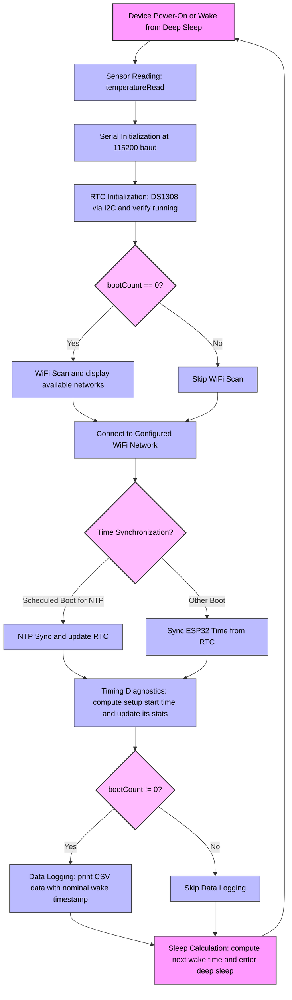

# ESP32-C3 Data Logger

A low-power data logger using ESP32-C3 Super Mini and DS1308 RTC, with sampling synchronized to Coordinated Universal Time (UTC). Suitable for sampling periods that are tens of seconds or longer. IoT data upload missing.

## Features

- **UTC synchronous sampling**: Sampling aligned to midnight UTC with sub-second-level time tracking. Local time zone is configurable but does not affect sampling
- **Power efficient**: Deep sleep between samples
- **Reliable timekeeping**: DS1308 (DS1307-compatible) RTC maintains time across deep sleep cycles
- **Smart time sync**: Scheduled NTP synchronization based on configured RTC drift and tolerance
- **WiFi connectivity**: Connects to configured network for NTP sync (and data upload which is not yet implemented)
- **Timing diagnostics**: Real-time tracking of sample time shift statistics (mean and RMS)
- **Configurable**: Adjustable sampling period and drift compensation

## Missing features (TODO)

- **WiFi connection timeout**: Add a configurable timeout
- **SD card**: Add data logging to SD card
- **Cloud upload**: Add data uploading to cloud (IoT)
- **Data buffering**: Buffer data in ESP32-C3 RTC SRAM (or on SD card) for more sparse transfers

## Hardware Requirements

- ESP32-C3 Super Mini module
- DS1308 RTC module connected via I²C to ESP32-C3
- Pull-up resistors for I²C:
  - 10kΩ(?) on GPIO8 (SDA)
  - 10kΩ(?) on GPIO9 (SCL)
 
(To be honest I'm not sure about the value or the need for each pull-up resistor.)

## Pin Configuration

| Component | Interface | Pin |
|-----------|-----------|-----|
| DS1308 RTC | I²C SDA | GPIO8 |
| DS1308 RTC | I²C SCL | GPIO9 |

## Getting Started

### 1. Setup Arduino IDE

Follow the [Getting Started with the ESP32-C3 Super Mini](https://randomnerdtutorials.com/getting-started-esp32-c3-super-mini/) tutorial.

### 2. Install Required Libraries

Install via Arduino Library Manager:

- `RTClib` by Adafruit (v2.1.1+)

Built-in ESP32 libraries (no installation needed):
- `WiFi.h`, `time.h`, `esp_sntp.h`, `Wire.h`

### 3. Configure Secrets

Create `esp32c3_data_logger/Secrets.h` by renaming `esp32c3_data_logger/Secrets.h.example` and configure your WiFi credentials there. You can also configure your time zone, but ESP32-C3 local time is not currently used for anything.

### 4. Upload and Monitor

Open `esp32c3_data_logger/esp32c3_data_logger.ino` in Arduino IDE, upload to your ESP32-C3, and monitor the serial output at 115200 baud.

During operation of the sketch, ESP32-C3 goes to deep sleep for tens of seconds at a time. This prevents further uploads. To enable another upload, press and release the ESP32-C3 Super mini in sequence: reset down, boot down, reset up, boot up. This also stops the serial monitor from stealing focus upon ESP32-C3 wakeup from deep sleep.

## Configuration

### Adjusting Sampling Interval

Edit `samplingPeriodSeconds` in the main sketch:

```cpp
constexpr uint64_t samplingPeriodSeconds = 30; // sampling period in seconds
```

The sketch aligns samples to evenly spaced slots from midnight UTC, so the device wakes at the next slot boundary.

### Fine-Tuning Timing

- **`adjustSleepSeconds`**: Compensates for the measured lag between ESP32-C3 wakeup and setup() start. Adjust if your sensor read timing differs.
- **`rtcDriftPpm`**: Maximum expected RTC drift in parts per million. Used to calculate NTP sync frequency.
- **`allowedDriftSeconds`**: Maximum allowed time drift before requiring NTP sync. Used to calculate NTP sync frequency.

NTP sync scheduling is automatically computed: `syncInterval = allowedDriftSeconds / (rtcDriftPpm / 1e6)`

## How It Works

### Boot Sequence



The ESP32-C3 Data Logger follows a structured sequence each time it wakes from power-on or deep sleep:

1. **Sensor reading**: Immediately read temperature using `temperatureRead()` to minimize timing errors. Logging of the data is in step 8. This is a placeholder for your own sensor reading.
2. **Serial initialization**:  Setup the serial monitor at 115200 baud for debugging and logging.
3. **RTC initialization**: Initialize the DS1308 RTC via I²C and verify it is running.
4. **WiFi scan**: On the first boot (bootCount = 0) only, scan for available networks and display them.
5. **WiFi connection**: Connect to the configured WiFi network.
6. **Time synchronization**  
   - For scheduled boots (every N samples), sync ESP32 time via NTP and update RTC.  
   - Otherwise, sync ESP32 time from the RTC.
7. **Timing diagnostics**: Compute the actual setup start time and update timing statistics for drift diagnostics.
8. **Data logging**: If this is not the first boot (bootCount ≠ 0), print CSV-formatted sensor data with the nominal wake timestamp. This is a placeholder for your own data logging.
9. **Sleep calculation**: Compute the next wake time and enter deep sleep until the next sample.

**Boot counter**: The `bootCount` variable persists across deep sleep in ESP32-C3 RTC memory and is incremented before each wake.

### Time Synchronization

The system uses two time sources:

- **DS1308 RTC**: External RTC for persistent timekeeping
- **ESP32 internal clock**: High-resolution timer sub-second precision

**Sync strategy:**
- On scheduled boots (`bootCount % ntpSyncIntervalSamplingPeriods == 0`):
  1. ESP32 syncs from NTP servers
  2. DS1308 RTC syncs from ESP32 at second boundary
- On other boots:
  - ESP32 syncs from DS1308 RTC at second boundary

This schedule minimizes network access while maintaining accurate time.

### Data Logging and Sleep

1. **Logging**: Prints CSV data with nominal wake timestamp and sensor value (from boot count 1 onwards)
2. **Timing diagnostics**: 
   - Calculates actual setup() start time by working backwards from current time using `esp_timer_get_time()`
   - Calculates sample time shift (difference between actual and nominal wake times)
   - Updates running statistics using Welford's online algorithm: mean and mean square
   - Displays shift, mean, and RMS (square root of mean square)
   - Statistics persist in RTC memory across boots
3. **Next wake calculation**: Computes next sampling slot aligned to midnight UTC
4. **Deep sleep**: Applies `adjustSleepSeconds` compensation and sleeps until next sample

## Serial Monitor Output

Example output:

```
============== ESP32-C3 Data Logger ==============
Boot count: 0
Initializing DS1308 RTC ... DONE, got time: 2025-11-08T14:32:16Z
Scanning WiFi ... DONE
0: My Network (-48 dBm)  SECURED  Matches the configured SSID
WiFi connecting to My Network ....... DONE, got local ip 192.168.178.58
Syncing time from NTP ......................................... DONE
Syncing DS1308 RTC from ESP32 ... DONE
Current time:
DS1308 RTC 2025-11-08T14:32:41Z
ESP32      2025-11-08T14:32:41.002675Z
Will sleep until 2025-11-08T14:33:00.000000Z
============== ESP32-C3 Data Logger ==============
Boot count: 1
Initializing DS1308 RTC ... DONE, got time: 2025-11-08T14:33:03Z
Compensated sample lag: 0.000056 seconds
WiFi connecting to My Network ....... DONE, got local ip 192.168.178.58
Boots remaining until NTP sync: 18
Syncing ESP32 time from DS1308 RTC ... DONE
Setup start time (estimated): 2025-11-08T14:32:59.952583Z
Sample time shift from nominal (estimated): -0.047 seconds (mean: -0.047, RMS: 0.047)
-----------------data logging-----------------
time,temperature_esp32
2025-11-08T14:33:00.000000Z,26.900000
----------------------------------------------
Current time:
DS1308 RTC 2025-11-08T14:33:06Z
ESP32      2025-11-08T14:33:06.002224Z
Will sleep until 2025-11-08T14:33:30.000000Z
```

### Understanding Timing Diagnostics

- **Compensated sample lag**: Total delay from wakeup to sensor reading, including `adjustSleepSeconds` compensation
- **Setup start time (estimated)**: When setup() began execution, calculated by subtracting `esp_timer_get_time()` from current time after time sync
- **Sample time shift**: Difference between actual setup start time and nominal wake time
  - **Mean**: Running average across all samples (from boot 1 onwards) - indicates systematic timing bias
  - **RMS**: Root mean square of shifts - indicates overall timing variation/jitter
  - Statistics use Welford's online algorithm for numerical stability

Note: Statistics are only calculated and displayed from boot count 1 onwards (after the first wake).

## Project Structure

```
esp32c3_data_logger/
├── esp32c3_data_logger.ino     # Main sketch
└── Secrets.h                   # WiFi and timezone configuration (you create this)
README.md                       # This file
LICENSE                         # MIT license
```

## Troubleshooting

* **RTC not found**: Check I²C connections and pull-up resistors (especially GPIO9)
* **Wi-Fi won't connect**: 
  - Verify SSID/password in Secrets.h
  - Ensure 2.4GHz network (ESP32-C3 doesn't support 5GHz)
  - Try commenting out: `WiFi.setTxPower(WIFI_POWER_8_5dBm);`
* **Time sync fails**: Check internet connectivity and NTP server accessibility
* **RTC time drift**: DS1308 accuracy depends on crystal quality and temperature. Adjust `rtcDriftPpm` or `allowedDriftSeconds` to change NTP sync frequency
* **Timing inconsistencies**: Ensure that both ESP32-C3 and the DS1308 RTC are continuously powered, also over the deep sleep periods. Monitor the sample time shift statistics. Large RMS values may indicate issues with deep sleep wake timing or RTC stability

## Technical details

* **WiFi power limiting**: WiFi power has been reduced by `WiFi.setTxPower(WIFI_POWER_8_5dBm);` [to go around an antenna design flaw](https://forum.arduino.cc/t/no-wifi-connect-with-esp32-c3-super-mini/1324046/13) in some early ESP32-C3 Super Mini modules.
* **UTC linearity**: This implementation assumes that UTC time is continuous and linear. Jumps such as leap seconds are not tolerated. There have been no leap seconds since 2015 and they are likely to be phased out from UTC, see [Resolution 4 of the 27th General Conference on Weights and Measures (CGPM), 2022](https://www.bipm.org/en/cgpm-2022/resolution-4). More subtle UTC adjustments might be tolerated by configuring a large enough maximum ppm drift.
* **DS1308 vs. ESP32-C3 RTC**: The external DS1308 RTC could probably be replaced by the ESP32-C3 internal RTC, by adding an external 32768 Hz xtal for ESP32-C3.

## Authors

Olli Niemitalo (Olli.Niemitalo@hamk.fi)

## Copyright

Copyright 2025 HAMK Häme University of Applied Sciences

## License

MIT License - See LICENSE file for details
