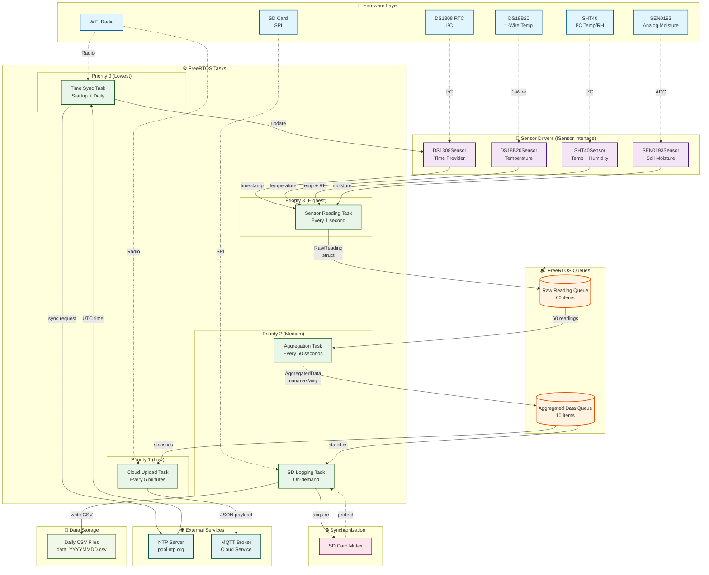

# ESP32-C3 Modular Data Logger

A production-ready, FreeRTOS-based IoT sensor data logger for ESP32-C3 using the Arduino framework. Features modular sensor architecture, robust multitasking, and reliable data logging.



## Features

- **Multi-sensor support**: DS18B20 (temperature), SHT40 (temp/humidity), SEN0193 (soil moisture)
- **Real-time clock**: DS1308 RTC with NTP synchronization
- **Robust multitasking**: FreeRTOS tasks with proper priorities and timing
- **SD card logging**: Thread-safe CSV logging with mutex protection
- **Pluggable architecture**: Easy to add new sensors via abstract interface
- **UTC time stamping**: All data logged in UTC to avoid timezone issues
- **Cloud ready**: MQTT upload task (configurable)

## Hardware Requirements

- ESP32-C3 development board
- DS1308 RTC module (I²C)
- DS18B20 temperature sensor (1-Wire)
- SHT40 temperature/humidity sensor (I²C)
- SEN0193 soil moisture sensor (Analog)
- SD card module (SPI)
- Pull-up resistors: 4.7kΩ for 1-Wire, 10kΩ for I²C (if not included on modules)

## Pin Configuration

| Component | Interface | Pin |
|-----------|-----------|-----|
| DS1308 RTC | I²C SDA | GPIO8 |
| DS1308 RTC | I²C SCL | GPIO9 |
| SHT40 | I²C SDA | GPIO8 |
| SHT40 | I²C SCL | GPIO9 |
| DS18B20 | 1-Wire | GPIO10 |
| SEN0193 | Analog | GPIO0 (ADC1_CH0) |
| SD Card | SPI MOSI | GPIO7 |
| SD Card | SPI MISO | GPIO2 |
| SD Card | SPI SCK | GPIO6 |
| SD Card | SPI CS | GPIO3 |

## Required Libraries

Install via Arduino Library Manager:

- `RTClib` by Adafruit (v2.1.1+)
- `DallasTemperature` by Miles Burton (v3.9.0+)
- `OneWire` by Paul Stoffregen (v2.3.7+)
- `Adafruit SHT4x Library` (v1.0.2+)
- `Adafruit BusIO` (dependency)
- `PubSubClient` by Nick O'Leary (v2.8+ for MQTT)

Built-in ESP32 libraries:
- `WiFi.h`
- `SD.h`
- `SPI.h`
- `time.h`

## Project Structure

```
esp32c3_data_logger/
├── esp32c3_data_logger.ino    # Main sketch (setup only)
├── Config.h                    # Pin definitions and configuration
├── RawReading.h                # Data structures
├── ISensor.h                   # Abstract sensor interface
├── DS18B20Sensor.h             # DS18B20 implementation
├── SHT40Sensor.h               # SHT40 implementation
├── SEN0193Sensor.h             # Soil moisture implementation
├── DS1308Sensor.h              # RTC time provider
├── SensorTask.cpp              # High-priority sensor reading task
├── AggregationTask.cpp         # Data aggregation and statistics
├── LoggingTask.cpp             # SD card I/O task
├── CloudTask.cpp               # Wi-Fi and MQTT upload task
├── TimeSync.cpp                # NTP synchronization
└── README.md                   # This file
```

## Task Architecture

| Task | Priority | Stack | Interval | Purpose |
|------|----------|-------|----------|---------|
| Sensor Reading | 3 (High) | 4096 | 1s | Read sensors, timestamp data |
| Aggregation | 2 (Medium) | 4096 | 60s | Calculate statistics, prepare data |
| SD Logging | 2 (Medium) | 8192 | On-demand | Write CSV files to SD card |
| Cloud Upload | 1 (Low) | 8192 | 5 min | Upload data via MQTT/HTTP |
| Time Sync | 0 (Lowest) | 4096 | Daily | Sync RTC with NTP |

## Configuration

Edit `Secrets.h` to customize:

```cpp
// Wi-Fi credentials
#define WIFI_SSID "your-ssid"
#define WIFI_PASSWORD "your-password"

// MQTT broker
#define MQTT_BROKER "mqtt.example.com"
#define MQTT_PORT 1883
```

Edit `Config.h` to customize:

```cpp
// NTP server
#define NTP_SERVER "pool.ntp.org"

// MQTT broker
#define MQTT_TOPIC "sensors/esp32c3"

// Timing intervals
#define SENSOR_READ_INTERVAL_MS 1000
#define AGGREGATION_INTERVAL_MS 60000
#define CLOUD_UPLOAD_INTERVAL_MS 300000
```


## Data Format

### Raw Reading Structure
```cpp
struct RawReading {
    time_t timestamp;           // Unix epoch (UTC)
    float ds18b20_temp;         // °C
    float sht40_temp;           // °C
    float sht40_humidity;       // %RH
    float sen0193_moisture_raw; // ADC value (0-4095)
};
```

### CSV Output Format
```csv
timestamp,ds18b20_temp,sht40_temp,sht40_humidity,soil_moisture
1730822400,22.5,23.1,45.2,1850
```

## Getting Started

1. **Install libraries** via Arduino Library Manager
2. **Edit Config.h** with your Wi-Fi and MQTT credentials
3. **Connect hardware** according to pin configuration
4. **Insert formatted SD card** (FAT32)
5. **Upload sketch** to ESP32-C3
6. **Monitor Serial** output at 115200 baud

## Adding New Sensors

1. Create new sensor class inheriting from `ISensor`:
```cpp
class NewSensor : public ISensor {
public:
    bool begin() override { /* init code */ }
    bool read(RawReading& data) override { /* read code */ }
    const char* getName() const override { return "NewSensor"; }
};
```

2. Add sensor fields to `RawReading` struct in `RawReading.h`
3. Instantiate in `SensorTask.cpp` and add to `activeSensors` vector
4. Update CSV headers in `LoggingTask.cpp`

## Troubleshooting

**RTC not found**: Check I²C connections and pull-up resistors
**SD card init failed**: Verify SPI wiring and ensure card is FAT32 formatted
**Wi-Fi won't connect**: Check SSID/password, ensure 2.4GHz network
**Sensor readings are NaN**: Check power supply, wiring, and sensor initialization
**Task watchdog triggered**: Increase stack size in task creation

## License

MIT License - See LICENSE file for details

## Contributing

Contributions welcome! Please follow the existing code style and test thoroughly before submitting PRs.
