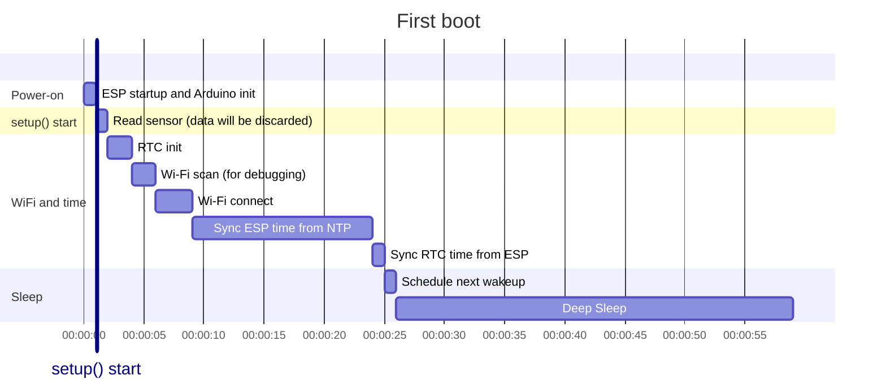
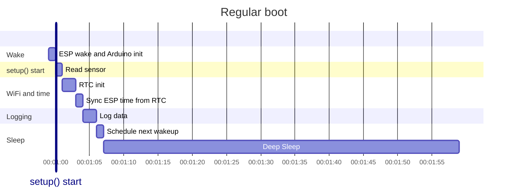
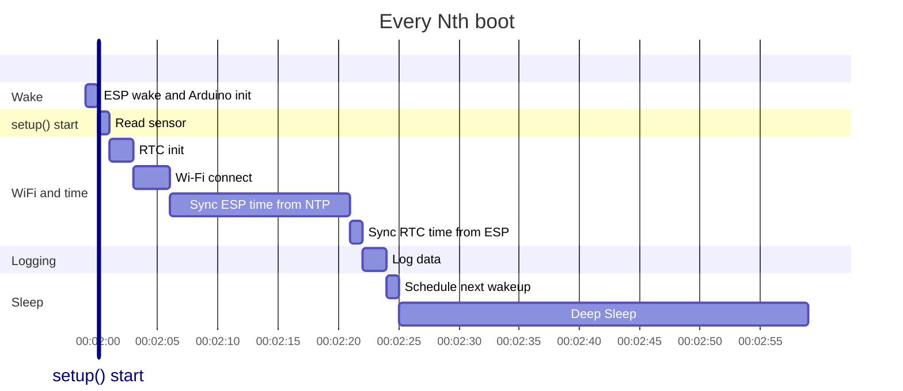
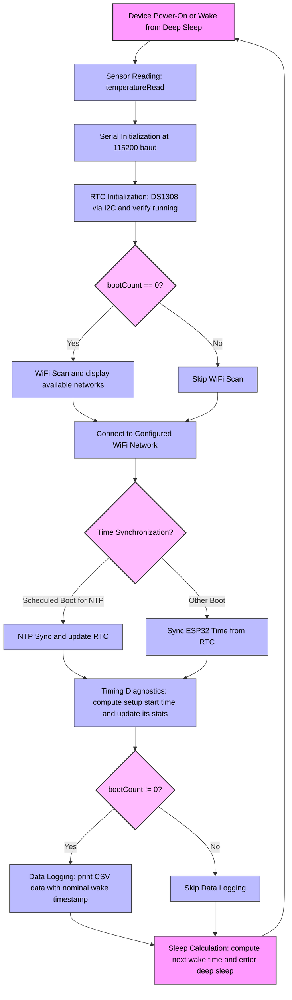

# ESP32-C3 Data Logger and File Server

A low-power data logger using ESP32-C3 Super Mini and DS1308 RTC, with sampling synchronized to Coordinated Universal Time (UTC). Suitable 20-second or longer sampling periods.

A file server that can be used to access the backup files stored in ESP32-C3 flash memory by the data logger.

## Features

Data logger:

- **UTC synchronous sampling**: Configurable sampling period with sampling aligned to midnight UTC. Sub-second-level time tracking. Local time zone is configurable but does not affect sampling
- **Power efficient**: Deep sleep between samples
- **Reliable timekeeping**: DS1308 (DS1307-compatible) RTC maintains time across deep sleep cycles
- **Smart time sync**: Scheduled NTP synchronization based on configured RTC drift and tolerance
- **Wakeup latency compensation**: Configurable ESP32-C3 wakeup latency compensation
- **WiFi connectivity**: Connects to configured network for NTP sync and data logging to cloud
- **Timing diagnostics**: Real-time tracking of sample time shift statistics (mean and RMS)
- **IoT data upload**: Data logging to cloud (ThingSpeak) with multi-field HTTP JSON POST request

File server:

- **Download data files**: Use a web browser to access ESP32-C3 at its intranet IP, to download backup data files.

## Missing features (TODO)

Data logger:

- **WiFi connection timeout**: Add a configurable timeout
- **SD card**: Add data logging to SD card
- **Data buffering**: Buffer data in ESP32-C3 RTC SRAM (or on SD card) for more sparse logging

## Hardware Requirements

- ESP32-C3 Super Mini module
- DS1308 RTC module connected via I²C to ESP32-C3
- Pull-up resistors for I²C:
  - 10kΩ(?) on GPIO8 (SDA)
  - 10kΩ(?) on GPIO9 (SCL)
 
(To be honest I'm not sure about the value or the need for each pull-up resistor.)

## Pin Configuration

| Component | Interface | Pin |
|-----------|-----------|-----|
| DS1308 RTC | I²C SDA | GPIO8 |
| DS1308 RTC | I²C SCL | GPIO9 |

## Project Structure

```
esp32c3_data_logger/
├── esp32c3_data_logger.ino     # Data logger main sketch
├── Secrets.h                   # WiFi, timezone, and ThingSpeak configuration (you create this)
└── Secrets.h.example           # A template you can use for creating Secrets.h
README.md                       # This file
LICENSE                         # MIT license
```

## Getting Started

### 1. Setup Arduino IDE

Follow the [Getting Started with the ESP32-C3 Super Mini](https://randomnerdtutorials.com/getting-started-esp32-c3-super-mini/) tutorial.

### 2. Install Required Libraries

Install with dependencies via Arduino Library Manager:

- `RTClib` by Adafruit (v2.1.1+)
- `ESP32 File Manager for Generation Klick` by Holger Lembke (v2.0.17+)

Built-in ESP32 libraries:

- `WiFi.h`
- `time.h`
- `esp_sntp.h`
- `Wire.h`
- `HTTPClient.h`

### 3. Configure Secrets

Create `esp32c3_data_logger/Secrets.h` by renaming `esp32c3_data_logger/Secrets.h.example` and configure your WiFi and ThingSpeak API credentials (see the next subsection) there. You can also configure your time zone, but ESP32-C3 local time is not currently used for anything.

### 4. ThingSpeak Configuration

ThingSpeak example:

1. Create a ThingSpeak channel at https://thingspeak.com
2. Configure 1 field:
   - Field 1: Temperature (°C)
3. Copy your Write API Key to Secrets.h

### 5. Upload and Monitor

Open `esp32c3_data_logger/esp32c3_data_logger.ino` in Arduino IDE, upload to your ESP32-C3, and monitor the serial output at 115200 baud.

During operation of the sketch, ESP32-C3 goes to deep sleep for tens of seconds at a time. This prevents further uploads. To enable another upload, press and release the ESP32-C3 Super mini in sequence: reset down, boot down, reset up, boot up. This also stops the serial monitor from stealing focus upon ESP32-C3 wakeup from deep sleep.

## Configuration

### Adjusting Sampling Interval

Edit `samplingPeriodSeconds` in the main sketch:

```cpp
constexpr uint64_t samplingPeriodSeconds = 30; // sampling period in seconds
```

The sketch aligns samples to evenly spaced slots from midnight UTC, so the device wakes at the next slot boundary.

### Fine-Tuning Timing

- **`adjustSleepSeconds`**: Compensates for the measured lag between ESP32-C3 wakeup and setup() start. Adjust if your sensor read timing differs.
- **`rtcDriftPpm`**: Maximum expected RTC drift in parts per million. Used to calculate NTP sync frequency.
- **`allowedDriftSeconds`**: Maximum allowed time drift before requiring NTP sync. Used to calculate NTP sync frequency.

NTP sync scheduling is automatically computed: `syncInterval = allowedDriftSeconds / (rtcDriftPpm / 1e6)`

## How It Works

### Boot Sequence (timings illustrative)

The sequence of tasks on each boot depends on whether it is the first boot (power-on), an Nth boot with a scheduled NTC sync, or a regular boot from deep sleep:







The detailed boot count conditional boot sequence:

1. **Sensor reading**: Immediately read temperature using `temperatureRead()` to minimize timing errors. Logging of the data is in step 8. This is a placeholder for your own sensor reading.
2. **Serial initialization**:  Setup the serial monitor at 115200 baud for debugging and logging.
3. **RTC initialization**: Initialize the DS1308 RTC via I²C and verify it is running.
4. **WiFi scan**: On the first boot (bootCount = 0) only, scan for available networks and display them.
5. **WiFi connection**: Connect to the configured WiFi network.
6. **Time synchronization**  
   - For scheduled boots (every N samples), sync ESP32 time via NTP and update RTC.  
   - Otherwise, sync ESP32 time from the RTC.
7. **Timing diagnostics**: Compute the actual setup start time and update timing statistics for drift diagnostics.
8. **Data logging**: If this is not the first boot (bootCount ≠ 0), print CSV-formatted sensor data with the nominal timestamp. Send sensor data to ThingSpeak with the nominal timestamp.
9. **Sleep calculation**: Compute the next wake time and enter deep sleep until the next sample.

**Boot counter**: The `bootCount` variable persists over deep sleep in ESP32-C3 RTC memory and is incremented just before deep sleep.

The same as a flowchart:



### Time Synchronization

The system uses two time sources:

- **DS1308 RTC**: External RTC for persistent timekeeping
- **ESP32 internal clock**: High-resolution timer with sub-second precision

**Sync strategy:**
- On scheduled boots (`bootCount % ntpSyncIntervalSamplingPeriods == 0`):
  1. ESP32 syncs from NTP servers
  2. DS1308 RTC syncs from ESP32 at second boundary
- On other boots:
  - ESP32 syncs from DS1308 RTC at second boundary

This schedule minimizes network access while maintaining accurate time.

### Data Logging, Diagnostics, and Sleep

1. **Logging**: Prints CSV data with nominal timestamp and sensor value (from boot count 1 onwards)
2. **Timing diagnostics**: 
   - Calculates actual setup() start time by working backwards from current time using `esp_timer_get_time()`
   - Calculates sample time shift (difference between actual and nominal wake times) using the above and the ESP32-C3 time synced from DS1308 RTC.
   - Updates running statistics of the time shift using Welford's online algorithm: mean and mean square
   - Displays shift, mean, and RMS (square root of mean square)
   - Statistics persist in RTC memory across boots
3. **Next wake calculation**: Computes next sampling slot with the sampling time grid aligned to midnight UTC
4. **Deep sleep**: Applies `adjustSleepSeconds` compensation and sleeps until next sample

## Serial Monitor Output

Example output:

```
10:11:56.243 -> ============== ESP32-C3 Data Logger ==============
10:11:56.243 -> Boot count: 0
10:11:56.243 -> Initializing DS1308 RTC ... DONE, got time: 2000-01-01T00:01:13Z
10:11:56.243 -> Scanning WiFi ... DONE
10:11:58.871 -> 0: OnePlus 13 2EAA  (-57 dBm)  SECURED  Matches the configured SSID
10:11:58.871 -> 1: moto7  (-73 dBm)  SECURED
10:11:58.871 -> WiFi connecting to OnePlus 13 2EAA ....... DONE, got local ip 10.48.8.100
10:12:00.851 -> Syncing time from NTP ....... DONE
10:12:02.889 -> Syncing DS1308 RTC from ESP32 ... DONE
10:12:03.662 -> Current time:
10:12:03.662 -> DS1308 RTC 2025-11-12T08:12:05Z
10:12:03.662 -> ESP32      2025-11-12T08:12:05.003068Z
10:12:03.662 -> Will sleep until 2025-11-12T08:12:30.000000Z
10:12:29.641 -> ============== ESP32-C3 Data Logger ==============
10:12:29.641 -> Boot count: 1
10:12:29.641 -> Initializing DS1308 RTC ... DONE, got time: 2025-11-12T08:12:30Z
10:12:29.641 -> WiFi connecting to OnePlus 13 2EAA ...... DONE, got local ip 10.48.8.100
10:12:31.176 -> Boots remaining until NTP sync: 18
10:12:31.176 -> Syncing ESP32 time from DS1308 RTC ... DONE
10:12:31.676 -> Setup start time (estimated): 2025-11-12T08:12:29.861684Z
10:12:31.676 -> Sample time shift from nominal (estimated): -0.138 seconds (mean: -0.138, RMS: 0.138)
10:12:31.676 -> -----------------data logging-----------------
10:12:31.676 -> time,temperature_esp32
10:12:31.676 -> 2025-11-12T08:12:30.000000Z,24.900000
10:12:31.676 -> ----------------------------------------------
10:12:31.676 -> Compensated sample lag: 0.000183 seconds
10:12:31.676 -> Posting to cloud ... DONE (HTTP 200, response: {"channel_id":3160355,"created_at":"2025-11-12T08:12:30Z","entry_id":1,"field1":24.9,"field2":null,"field3":null,"field4":null,"field5":null,"field6":null,"field7":null,"field8":null,"latitude":null,"longitude":null,"elevation":null,"status":null})
10:12:33.645 -> Current time:
10:12:33.645 -> DS1308 RTC 2025-11-12T08:12:34Z
10:12:33.645 -> ESP32      2025-11-12T08:12:34.982826Z
10:12:33.645 -> Will sleep until 2025-11-12T08:13:00.000000Z
10:12:59.484 -> ============== ESP32-C3 Data Logger ==============
10:12:59.484 -> Boot count: 2
10:12:59.484 -> Initializing DS1308 RTC ... DONE, got time: 2025-11-12T08:13:00Z
10:12:59.484 -> WiFi connecting to OnePlus 13 2EAA ...... DONE, got local ip 10.48.8.100
10:13:01.018 -> Boots remaining until NTP sync: 17
10:13:01.018 -> Syncing ESP32 time from DS1308 RTC ... DONE
10:13:01.686 -> Setup start time (estimated): 2025-11-12T08:12:59.818689Z
10:13:01.686 -> Sample time shift from nominal (estimated): -0.181 seconds (mean: -0.160, RMS: 0.161)
10:13:01.686 -> -----------------data logging-----------------
10:13:01.686 -> time,temperature_esp32
10:13:01.686 -> 2025-11-12T08:13:00.000000Z,24.900000
10:13:01.686 -> ----------------------------------------------
10:13:01.686 -> Compensated sample lag: 0.000187 seconds
10:13:01.686 -> Posting to cloud ... DONE (HTTP 200, response: {"channel_id":3160355,"created_at":"2025-11-12T08:13:00Z","entry_id":2,"field1":24.9,"field2":null,"field3":null,"field4":null,"field5":null,"field6":null,"field7":null,"field8":null,"latitude":null,"longitude":null,"elevation":null,"status":null})
10:13:03.016 -> Current time:
10:13:03.016 -> DS1308 RTC 2025-11-12T08:13:04Z
10:13:03.016 -> ESP32      2025-11-12T08:13:04.356238Z
10:13:03.016 -> Will sleep until 2025-11-12T08:13:30.000000Z
```

## Troubleshooting

* **RTC not found**: Check I²C connections and pull-up resistors (especially GPIO9)
* **Wi-Fi won't connect**: 
  - Verify SSID/password in Secrets.h
  - Ensure 2.4GHz network (ESP32-C3 doesn't support 5GHz)
  - Try commenting out: `WiFi.setTxPower(WIFI_POWER_8_5dBm);`
* **Time sync fails**: Check internet connectivity and NTP server accessibility
* **RTC time drift**: DS1308 accuracy depends on crystal quality and temperature. Adjust `rtcDriftPpm` or `allowedDriftSeconds` to change NTP sync frequency
* **Timing inconsistencies**: Ensure that both ESP32-C3 and the DS1308 RTC are continuously powered, also over the deep sleep periods. Monitor the sample time shift statistics. Large RMS values may indicate issues with deep sleep wake timing or RTC stability
* **ThingSpeak upload fails**: 
  - Verify API key in Secrets.h
  - Check internet connectivity
  - Ensure ThingSpeak channel has Field1 and Field2 configured
  - Check ThingSpeak rate limits (15 second minimum between updates for free accounts)

## Technical details

* **WiFi power limiting**: WiFi power has been reduced by `WiFi.setTxPower(WIFI_POWER_8_5dBm);` [to go around an antenna design flaw](https://forum.arduino.cc/t/no-wifi-connect-with-esp32-c3-super-mini/1324046/13) in some early ESP32-C3 Super Mini modules.
* **UTC linearity**: This implementation assumes that UTC time is continuous and linear. Jumps such as leap seconds are not tolerated. There have been no leap seconds since 2015 and they are likely to be phased out from UTC, see [Resolution 4 of the 27th General Conference on Weights and Measures (CGPM), 2022](https://www.bipm.org/en/cgpm-2022/resolution-4). More subtle UTC adjustments might be tolerated by configuring a large enough maximum ppm drift.
* **DS1308 vs. ESP32-C3 RTC**: The external DS1308 RTC could probably be replaced by the ESP32-C3 internal RTC, by adding an external 32768 Hz xtal for ESP32-C3.

## ESP32-C3 File Server


ESP32 File Manager for Generation Klick

## Authors

Olli Niemitalo (Olli.Niemitalo@hamk.fi)

## Copyright

Copyright 2025 HAMK Häme University of Applied Sciences

## License

MIT License - See LICENSE file for details
